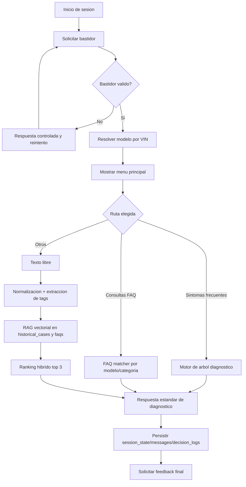

# POC Asistente Conversacional Tecnico de Diagnostico por Bastidor

Este repositorio contiene la base preparatoria de una prueba de concepto (POC) para un asistente conversacional tecnico orientado al diagnostico de motocicletas. La POC valida un enfoque hibrido que combina flujo guiado por reglas (bastidor, menu y arbol), resolucion FAQ y entrada libre con recuperacion semantica vectorial.

## Objetivo de esta fase (Fase 1 - Preparacion)

La fase actual es estrictamente de infraestructura y documentacion:

- definir arquitectura monolito modular,
- preparar solo el andamiaje de carpetas,
- definir el esquema SQL con soporte vectorial,
- dejar una base clara para explicar el diseno al equipo.

No se implementa logica de negocio ni codigo funcional de frontend/backend en esta etapa.

## Arquitectura elegida (escalable)

La arquitectura definida para esta POC es un monolito modular por dominios (modular monolith).

Esto significa:

- una sola aplicacion desplegable en esta fase,
- modulos internos desacoplados por responsabilidad,
- contratos claros entre capas (API, orquestacion, datos, UI).

Por que esta arquitectura SI es escalable:

- Escalado funcional: agregar nuevas capacidades creando modulos nuevos sin reescribir los actuales.
- Escalado de equipo: cada modulo puede tener ownership tecnico independiente.
- Escalado tecnico: cuando haga falta, un modulo puede extraerse a servicio separado reutilizando contratos.
- Escalado de datos: PostgreSQL + pgvector permite crecer en volumen manteniendo trazabilidad y busqueda semantica.

Ruta de evolucion prevista:

1. POC: monolito modular (rapido, controlado y simple de operar).
2. MVP: modularidad reforzada + contratos versionados + pruebas integradas.
3. Escala mayor: separar modulos criticos en servicios, solo si el volumen o la organizacion lo requiere.

## Principios de escalabilidad y facilidad de cambio

Estas reglas guian todas las fases siguientes para crecer sin rehacer la base:

- Separacion de responsabilidades: cada modulo cumple una sola funcion clara.
- Contratos estables: cambios entre frontend y backend deben pasar por contratos versionados.
- Cambios aditivos primero: preferir agregar nuevas piezas antes de romper estructuras existentes.
- Configuracion externa: parametros de entorno fuera del codigo para cambiar proveedores o despliegues rapido.
- Migraciones controladas: toda evolucion de base de datos debe ser incremental y trazable.
- Trazabilidad desde el inicio: cada decision importante debe poder reconstruirse en logs/estado.

Objetivo practico: que un cambio de proveedor, modulo o flujo no obligue a redisenar todo el proyecto.

## Arquitectura de alto nivel

- Frontend: Next.js para una UI de chat con quick replies y estado de sesion visible.
- Backend: FastAPI para exponer endpoints conversacionales y de metricas.
- Orquestacion: LangGraph para controlar flujo, estado y rutas de decision.
- Persistencia: PostgreSQL para datos transaccionales y trazabilidad.
- Recuperacion semantica: pgvector para busqueda vectorial de casos y FAQs.

## Estructura del repositorio

```text
.
|-- backend/
|   |-- app/
|   |   |-- api/
|   |   |-- core/
|   |   |-- db/
|   |   `-- modules/
|   `-- tests/
|-- database/
|   `-- migrations/
|-- docs/
|   `-- DDT.md
|-- frontend/
|   |-- app/
|   |-- components/
|   `-- lib/
`-- docker-compose.yml
```

## Responsabilidad de carpetas (vista didactica)

| Carpeta | Responsabilidad en la arquitectura |
| --- | --- |
| frontend/app | Shell de la app web y composicion de pantallas conversacionales. |
| frontend/components | Componentes UI reutilizables del chat (mensajes, quick replies, etc.). |
| frontend/lib | Tipos y utilidades de integracion con API. |
| backend/app/api | Contratos HTTP de sesion, mensajes, feedback y metricas. |
| backend/app/core | Configuracion transversal y observabilidad. |
| backend/app/db | Acceso a datos y modelos de persistencia. |
| backend/app/modules | Modulos funcionales del DDT (orquestador, FAQ, arbol, otros, ranking, trazabilidad). |
| database/migrations | SQL versionado para crear esquema y evolucionarlo por fases. |

Nota de alcance: en esta fase las carpetas existen para comunicar la arquitectura; su implementacion interna se construye en siguientes iteraciones.

## Stack tecnologico y justificacion tecnica

| Capa | Tecnologia | Justificacion para MVP gratuito/open source |
| --- | --- | --- |
| Frontend | Next.js | Productividad alta, SSR/CSR flexible y despliegue simple para demo. |
| Backend API | FastAPI | Desarrollo rapido, tipado fuerte y muy buena experiencia para APIs de POC. |
| Orquestacion conversacional | LangGraph | Control explicito del estado y del flujo hibrido sin delegar todo al LLM. |
| Base de datos | PostgreSQL | Motor robusto, libre y estandar para evolucionar de POC a MVP. |
| Busqueda semantica | pgvector | Evita sumar otra base especializada; mantiene simplicidad operativa. |

## Que es pgvector y por que se usa aqui

pgvector es una extension de PostgreSQL que agrega el tipo VECTOR y operadores de similitud.
En esta POC se usa para guardar embeddings en las tablas de conocimiento (historical_cases y faqs)
y poder recuperar casos similares por cercania semantica.

Ventajas para esta fase:

- misma base de datos para datos transaccionales y busqueda vectorial,
- menos complejidad operativa (sin Elasticsearch/Pinecone/otro motor adicional),
- facil de evolucionar luego a Supabase o PostgreSQL administrado.

## Por que hay muchos modulos en backend aunque esten vacios

El backend se preparo con muchos modulos por una razon de arquitectura, no por complejidad innecesaria:

- cada modulo representa una responsabilidad funcional definida en el DDT,
- evita mezclar reglas de negocio distintas en una sola capa,
- permite desarrollar por fases sin reestructurar carpetas despues,
- facilita trazabilidad, testing y ownership tecnico por componente.

En Fase 1 estos modulos solo existen como limites de arquitectura. La implementacion llega en fases siguientes.

Opciones de despliegue futuro (sin comprometer la fase actual):

- Supabase: PostgreSQL administrado con soporte pgvector.
- Vercel: despliegue rapido del frontend Next.js.
- Groq/OpenRouter: proveedor LLM configurable para clasificacion/redaccion.

## Flujo funcional del asistente (Mermaid)

Nota de preview:

- Para previsualizar el diagrama dentro del README, usa la vista previa Markdown normal de VS Code.
- Para previsualizar solo el diagrama con una extension Mermaid, abre el archivo [docs/diagrams/flujo-asistente.mmd](docs/diagrams/flujo-asistente.mmd).



## Explicacion nodo por nodo del diagrama

| Nodo | Que representa | Para que sirve en la POC |
| --- | --- | --- |
| A | Inicio de sesion | Punto de entrada del usuario al asistente. |
| B | Solicitar bastidor | Fuerza la regla principal: no hay diagnostico sin identificar vehiculo. |
| C | Decision bastidor valido | Controla si el VIN existe o no en el dataset mock. |
| D | Respuesta controlada y reintento | Maneja error esperado sin romper la conversacion. |
| E | Resolver modelo por VIN | Fija el modelo en sesion para contextualizar todo lo siguiente. |
| F | Mostrar menu principal | Presenta las 3 rutas de interaccion definidas en el DDT. |
| G | Decision de ruta elegida | Enruta hacia sintomas, FAQ o texto libre. |
| H | Motor de arbol diagnostico | Ejecuta flujo guiado para sintomas conocidos. |
| I | FAQ matcher | Responde consultas frecuentes por coincidencia de modelo/categoria. |
| J | Texto libre | Entrada abierta para casos no cubiertos por menu directo. |
| K | Normalizacion y extraccion | Limpia texto y obtiene senales utiles (tags/atributos). |
| L | RAG vectorial | Recupera casos/FAQs similares usando embeddings en pgvector. |
| M | Ranking hibrido top 3 | Ordena hipotesis probables para salida controlada. |
| N | Respuesta estandar de diagnostico | Devuelve formato unificado (hipotesis, alternativas, siguiente paso). |
| O | Persistir trazabilidad y estado | Guarda contexto y decisiones para auditoria y continuidad. |
| P | Solicitar feedback final | Cierra la sesion con evaluacion de utilidad para metricas. |

Lectura rapida del flujo:

- A-B-C-D-E validan identidad tecnica del vehiculo.
- F-G-H-I-J definen la estrategia de entrada del usuario.
- K-L-M-N construyen la respuesta en el camino de texto libre.
- O-P aseguran trazabilidad y aprendizaje de uso.

## Levantar base de datos local con Docker

1. Verificar Docker Desktop activo.
2. Desde la raiz del proyecto, ejecutar:

   ```bash
   docker compose up -d
   ```

3. Confirmar salud del contenedor:

   ```bash
   docker compose ps
   ```

   Nota: la carpeta database/migrations se monta en /docker-entrypoint-initdb.d.
   PostgreSQL ejecuta esos scripts automaticamente solo en la inicializacion del volumen.

4. Validar que PostgreSQL responde:

   ```bash
   docker exec -it poc_asistente_postgres psql -U asistente_user -d asistente_poc -c "SELECT NOW();"
   ```

5. Verificar tablas creadas por la migracion:

   ```bash
   docker exec -it poc_asistente_postgres psql -U asistente_user -d asistente_poc -c "\dt"
   ```

6. (Opcional) revisar indices vectoriales HNSW:

   ```bash
   docker exec -it poc_asistente_postgres psql -U asistente_user -d asistente_poc -c "\di"
   ```

## Cronograma (4 semanas)

| Semana | Objetivo | Entregables |
| --- | --- | --- |
| Semana 1 | Base tecnica y persistencia | Migraciones, dataset mock, scaffolding API/UI, sesion inicial. |
| Semana 2 | Flujos guiados | Bastidor obligatorio, menu principal, arbol Paradas de motor y CELP simplificado. |
| Semana 3 | Entrada libre y recuperacion | Modulo Otros, parser inicial, recuperacion vectorial, ranking top-3. |
| Semana 4 | Cierre de POC y validacion | Trazabilidad completa, feedback, metricas, pruebas E2E y demo final. |

## Criterios de preparacion cumplidos en este repo

- separacion clara frontend/backend/database,
- docker-compose listo para PostgreSQL + pgvector,
- migracion SQL inicial completa con indices clasicos y vectoriales,
- documentacion base para onboarding tecnico del equipo,
- estructura deliberadamente minima para avanzar fase por fase.

## Siguientes pasos (fase de implementacion)

1. Cargar dataset mock en migraciones de seed.
2. Implementar endpoints definidos en el DDT.
3. Implementar orquestacion por estados con LangGraph.
4. Conectar UI de chat a la API.